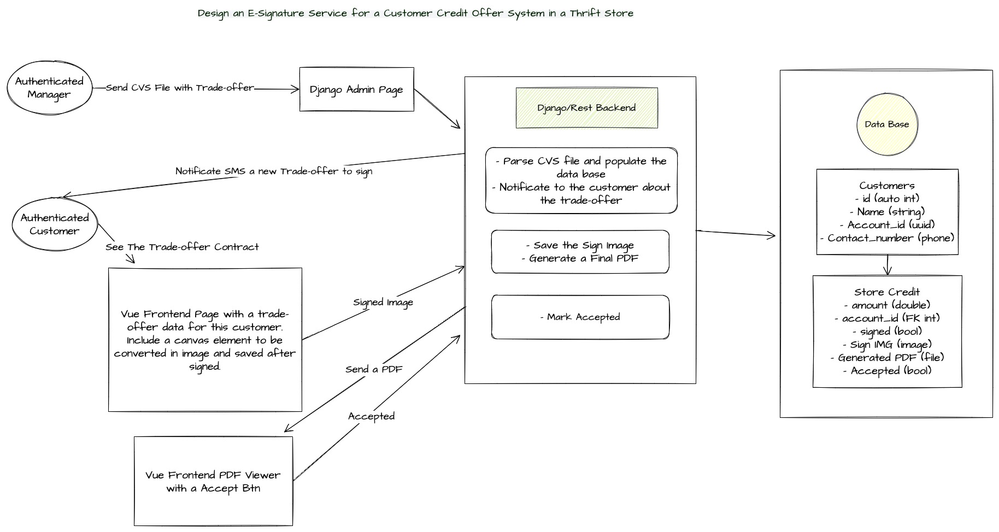

## Requirements:
1. Elaborate on the architectural design to accomplish the proposed solution.

2. Detail how you intend to augment the existing backend to incorporate e-signature capabilities.
I strong recommend use a third part service like [Docusign](https://www.docusign.com/es-mx/integraciones), [SignNow](https://www.signnow.com/developers), etc. for services with a strong legal requiremnts. I have work for startup that only require a pdf with the customer sign and others that uses a blockchain services to generate a cryptographic sign.

3. Propose a database schema to accommodate e-signatures and other relevant data.

For this example I would like to have two tables.
- Customer and StoreCredit

Customer
- id (auto int)
- name (string)
- account_id (uuid)
- contact_phone (django phone field)

StoreCredit
- id (auto int)
- amount (float)
- account_id (FK Customer__account_id)
- signed (bool)
- sign_img (image)
- generated_pdf (file)
- accepted (bool)

4. Describe the procedural flow for the CSV file upload, parsing, storage, and subsequent SMS-trigger for contract linking.
In my solution, a manager use django admin to save the CSV file. Django admin views can be modified adding a new Form with parse CVS file functionalities. In python there is a cvs module or also can be used a third part packages like pandas. Once the file is parsed and read, the backend can create a new StoreCredit object and save in a list, and after process all rows in the cvs apply a bulk saved. After that, the backend can create a process to notificate each customer using a third part api like Twilio. If the backend integrate celery, I strong recommend uses celery for sms notification.

5. Outline the approach for implementing the e-contract and e-signature functionalities on the frontend.
In my experiencie the fast, more secure and not cheaper solution is implement a third part service like I said before. But each project is diferent. In one project one startup ask me to renderize the html with the same design as a pdf, and a little canvas in the bottom center with the posibilite to draw there. I send the draw to the backend and generate a pdf and the customer press a ok button. In my opinion was the approach that they need. 

6. Identify the specific technologies or libraries best suited for implementing e-signature and SMS features.
I have worked with Docusign and Twilio. 

7. Discuss the security protocols and considerations to be instituted.
- In Django uses .env files with keys values.
- Never upload any key to github. (email, database, third part api - credentials)
- Use stables packages.
- Test each view enforce auth.
- In big team have DEV servers and not share productions keys.
- In django uses ADMIN_MAIL to notificate each error
- Parse each entry in frontend (be aware about sql inyection, etc)
- Protect apache or nginx rules
- Protect aws or google permission IAM

8. Develop a contingency plan for error-handling across various stages of the operation.
- In Django first enable MAIL_ADMIN and logging
- Im not sure about Vue, but in React I have implemented a catch over the error page in react-router and notificate the backend with each error.
- In Django implement @transaction.atomic to rollback database operation through diferents stages when errors happens.

9. Enumerate the testing methodologies to ensure system reliability and performance.
- Unity test for get correct values like decimals, operations, etc en each function, method or class.
- Enforce the bussines rules with functionals tests.
- You can use integrations test in an enviroment with multiples system to check they work well together.
- Apply performace testing to ensure speed and scalability.
- If the solution become big, you can implement smoke test to reduce the time testing (due the fact they verify some important functions before continue)
- For me is important implement algoritms with good BigO timing, check the quality of the code and messure the Django hits the database using tools like Django Debug Toolbar.

